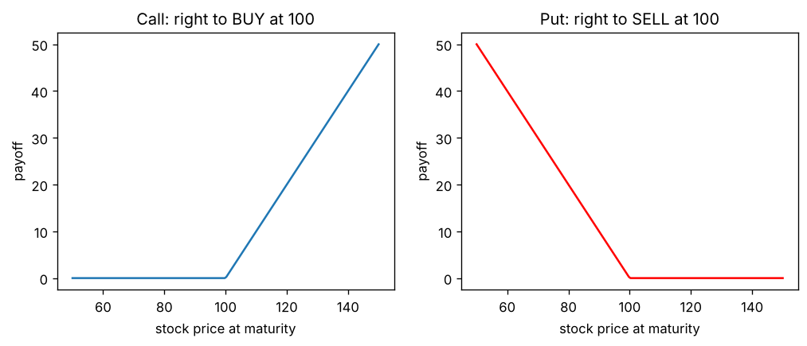
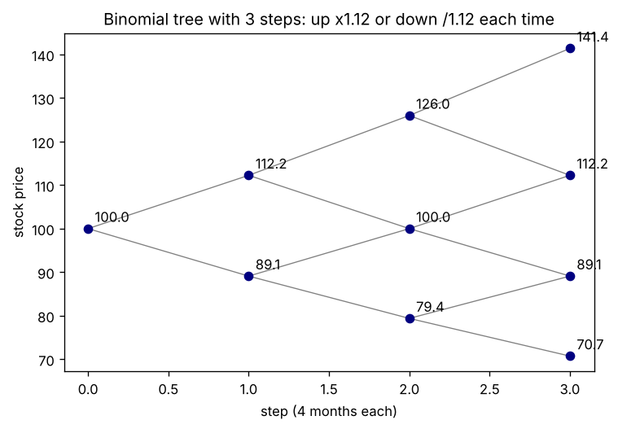
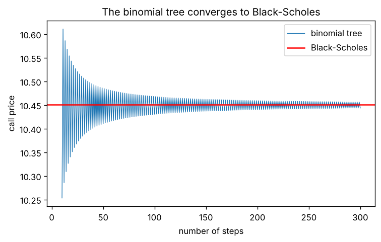
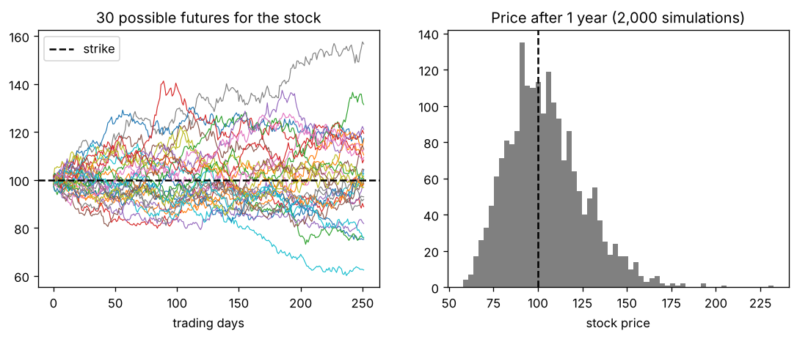
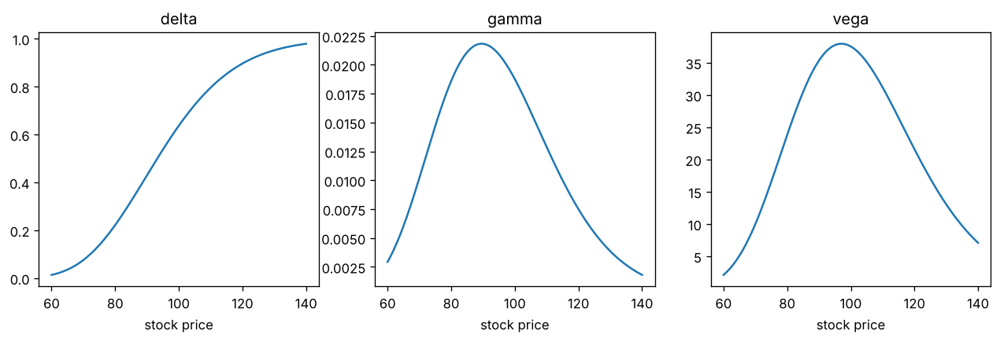
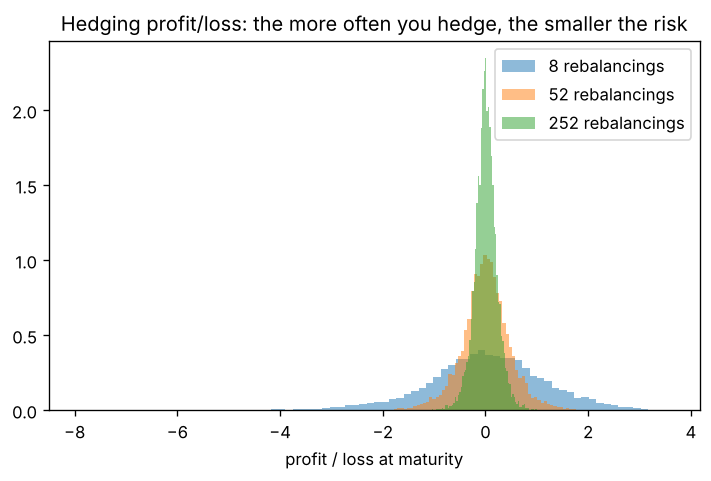

# Mes notes de lecture : comment on calcule le prix d'une option

Ce document résume ce que j'ai compris en lisant les trois textes fondateurs du pricing d'options, et ce que j'ai vérifié moi-même avec le code de ce dossier. Les sources sont listées à la fin.

---

## 1. Point de départ : c'est quoi une option ?

Une option, c'est un droit, pas une obligation.

- Un **call** donne le droit d'**acheter** une action à un prix fixé à l'avance (le _strike_), à une date donnée.
- Un **put** donne le droit de la **vendre** à ce prix.

Exemple : l'action vaut 100 €, j'achète un call de strike 100 € à un an. Si dans un an l'action vaut 130 €, j'exerce, j'achète à 100 et je gagne 30 €. Si elle vaut 80 €, je n'exerce pas et je ne gagne rien. Je ne peux pas perdre plus que ce que j'ai payé l'option.

La forme de ces courbes explique tout : le gain est nul d'un côté et augmente de l'autre. Le problème, c'est de savoir **combien payer ce droit aujourd'hui**, alors qu'on ne connaît pas le prix futur de l'action. C'est la question à laquelle répondent les trois méthodes ci-dessous.

---

## 2. Black et Scholes (1973) : la formule

**Le contexte** Avant 1973, plusieurs économistes avaient proposé des formules, mais elles dépendaient du rendement _espéré_ de l'action et du goût du risque de l'investisseur. Personne ne peut mesurer ces deux choses, donc ces formules étaient inutilisables en pratique.

**L'idée qui change tout** Fischer Black et Myron Scholes montrent qu'on peut construire un portefeuille sans risque en combinant l'option et l'action dans la bonne proportion. Quand l'action monte, l'option monte aussi. Si on détient la bonne quantité d'action en face, les deux mouvements se compensent. Un portefeuille sans risque doit rapporter exactement le taux sans risque, sinon il y aurait de l'argent gratuit à gagner (un _arbitrage_). De cette égalité sort une équation, et de cette équation sort la formule.

Ce qui m'a le plus frappé : **le rendement espéré de l'action n'apparaît pas dans la formule**. Que tout le monde pense que l'action va monter ou baisser ne change pas le prix de l'option. Le prix dépend seulement de cinq choses : le prix de l'action, le strike, la durée, le taux d'intérêt et la **volatilité** (à quel point l'action bouge).

**Les hypothèses du papier** Ils les écrivent explicitement au début : taux d'intérêt constant, volatilité constante, pas de dividende, pas de frais de transaction, possibilité d'acheter et vendre en continu, option européenne (exercée seulement à l'échéance). Aucune n'est parfaitement vraie, et c'est justement ce que les modèles plus récents essaient de corriger.

**Le titre complet** est _The Pricing of Options and Corporate Liabilities_, « et des dettes des entreprises ». Ils remarquent que les actions d'une entreprise endettée se comportent comme une option sur la valeur de l'entreprise. Ça relie le pricing d'options à la finance d'entreprise, ce que je ne m'attendais pas à trouver.

**Un peu d'histoire** Le papier a d'abord été refusé par des revues avant d'être publié dans le _Journal of Political Economy_ (selon le récit souvent rapporté). La même année, en avril 1973, ouvre le Chicago Board Options Exchange, le premier marché organisé d'options. Les traders adoptent la formule très vite. En 1997, Myron Scholes et Robert Merton (qui a généralisé le modèle) reçoivent le prix Nobel d'économie. Fischer Black, mort en 1995, ne pouvait plus le recevoir.

**Ce que j'ai vérifié dans le code** Pour une action à 100 €, strike 100 €, un an, taux 5 %, volatilité 20 %, la formule donne **10,45 €**. Avec la fonction `implied_volatility`, j'ai aussi fait le chemin inverse : si le marché vend cette option 12 €, c'est qu'il anticipe une volatilité de 24 %. C'est comme ça que les traders se parlent : ils citent des volatilités plutôt que des prix.

---

## 3. Cox, Ross et Rubinstein (1979) : l'arbre binomial

**Pourquoi ce papier** La démonstration de Black-Scholes utilise des mathématiques avancées (calcul stochastique). Cox, Ross et Rubinstein veulent montrer qu'on peut retrouver le même résultat avec des outils très simples. Leur titre le dit : _Option Pricing: A Simplified Approach_. Ils reconnaissent eux-mêmes que l'idée vient en partie de William Sharpe.

**L'idée** On découpe le temps en étapes. À chaque étape, l'action ne peut faire que deux choses : monter ou descendre.

**L'exemple qui m'a fait comprendre** Un seul pas d'un an. L'action vaut 100 € et finira soit à 120 €, soit à 80 €. Le call de strike 100 € vaudra donc 20 € ou 0 €.

Si j'achète 0,5 action et que j'emprunte 38,05 € (soit 40 € à rembourser dans un an au taux de 5 %), dans un an j'ai :

- si l'action monte : 0,5 × 120 − 40 = 20 €,
- si elle baisse : 0,5 × 80 − 40 = 0 €.

C'est exactement ce que paie l'option, dans les deux cas. Ce portefeuille et l'option doivent donc valoir la même chose aujourd'hui : 0,5 × 100 − 38,05 = **11,95 €**. Je n'ai eu besoin d'aucune probabilité sur la hausse ou la baisse. C'est le même argument que Black-Scholes (la réplication), mais visible à la main.

**Pour plusieurs étapes**, on part des gains à l'échéance (à droite de l'arbre) et on remonte nœud par nœud jusqu'à aujourd'hui. Avec beaucoup d'étapes, le résultat se rapproche de Black-Scholes, ce que les auteurs démontrent dans le papier.

Dans mon code, avec 1 000 étapes, l'arbre donne 10,4486 € contre 10,4506 € pour la formule. Le graphique montre aussi que l'écart oscille entre positif et négatif selon que le nombre d'étapes est pair ou impair, avant de se resserrer.

**Le vrai avantage de l'arbre : les options américaines** Une option américaine peut être exercée à tout moment. Black-Scholes ne sait pas la calculer, l'arbre si. À chaque nœud, on compare la valeur de l'option si on attend et ce qu'on gagne en exerçant tout de suite, et on garde le maximum. Pour un put dans mon exemple, l'américain vaut 6,09 € contre 5,57 € pour l'européen. Ce droit d'exercer tôt vaut donc environ 0,52 €.

---

## 4. Boyle (1977) : la méthode de Monte Carlo

**L'idée** Phelim Boyle est le premier à appliquer la simulation au calcul du prix d'une option. Le principe est presque naïf. On simule au hasard des milliers de trajectoires possibles pour l'action, on calcule ce que l'option rapporte dans chacune, on fait la moyenne et on actualise.

À gauche, 30 avenirs possibles pour l'action. À droite, la répartition du prix au bout d'un an sur 2 000 simulations. Elle n'est pas symétrique : l'action ne peut pas descendre sous zéro mais peut monter beaucoup. C'est la loi « log-normale », la même hypothèse que Black-Scholes.

**Le point faible**, que Boyle discute déjà : la précision s'améliore lentement. Pour diviser l'erreur par 2, il faut 4 fois plus de simulations. Il présente aussi des astuces pour réduire l'erreur (les variables antithétiques et les variables de contrôle). Dans mon code, avec un million de simulations, j'obtiens 10,47 € ± 0,03 €, ce qui encadre bien les 10,45 € de la formule.

**Pourquoi l'utiliser quand même** Pour une option simple, c'est la méthode la moins efficace des trois. Mais quand le produit devient compliqué (gain qui dépend de la moyenne des prix, de plusieurs actions à la fois…), il n'y a plus de formule et l'arbre devient énorme. Monte Carlo continue de marcher. C'est pour ça que les banques l'utilisent beaucoup aujourd'hui.

---

## 5. Ce que j'en retiens

Les trois méthodes reposent sur la même idée de fond : **le prix d'une option, c'est le coût pour la reproduire avec l'action et de l'argent emprunté**. Black-Scholes le fait en temps continu avec une formule, l'arbre le fait étape par étape, Monte Carlo le calcule par simulation.

| Méthode        | Ce qu'elle fait bien                     | Sa limite                                 |
| -------------- | ---------------------------------------- | ----------------------------------------- |
| Black-Scholes  | Instantanée et exacte                    | Seulement les options européennes simples |
| Arbre binomial | Options américaines, facile à comprendre | Lent si le produit est complexe           |
| Monte Carlo    | Produits très complexes                  | Converge lentement                        |

## A venir

Pour la couverture, la notion clé est le **delta** : la sensibilité du prix de l'option au prix de l'action. Avec ses cousins (le gamma, qui mesure à quelle vitesse le delta change, et le vega, la sensibilité à la volatilité), on les appelle les _grecques_.

J'ai aussi testé l'argument de couverture (le _delta hedging_) : une banque vend un call et se couvre en détenant « delta » actions. Plus elle ajuste souvent sa couverture, plus son risque diminue : l'écart-type de son résultat passe de 1,18 € avec 8 ajustements à 0,22 € avec un ajustement par jour. Ça confirme l'intuition de Black et Scholes : avec une couverture continue, le risque disparaît.

---

## Sources

**Les trois papiers**

- Black, F. & Scholes, M. (1973). The Pricing of Options and Corporate Liabilities. _Journal of Political Economy_, 81(3), 637–654. https://doi.org/10.1086/260062
- Cox, J. C., Ross, S. A. & Rubinstein, M. (1979). Option Pricing: A Simplified Approach. _Journal of Financial Economics_, 7(3), 229–263. https://doi.org/10.1016/0304-405X(79)90015-1
- Boyle, P. P. (1977). Options: A Monte Carlo Approach. _Journal of Financial Economics_, 4(3), 323–338. https://doi.org/10.1016/0304-405X(77)90005-8

**Pour aller plus loin**

- Merton, R. C. (1973). Theory of Rational Option Pricing. _Bell Journal of Economics and Management Science_, 4(1), 141–183.
- Hull, J. C. _Options, Futures, and Other Derivatives_. Pearson. Le manuel de référence ; j'y ai vérifié mes résultats.
- Communiqué du prix Nobel d'économie 1997 : https://www.nobelprize.org/prizes/economic-sciences/1997/press-release/
